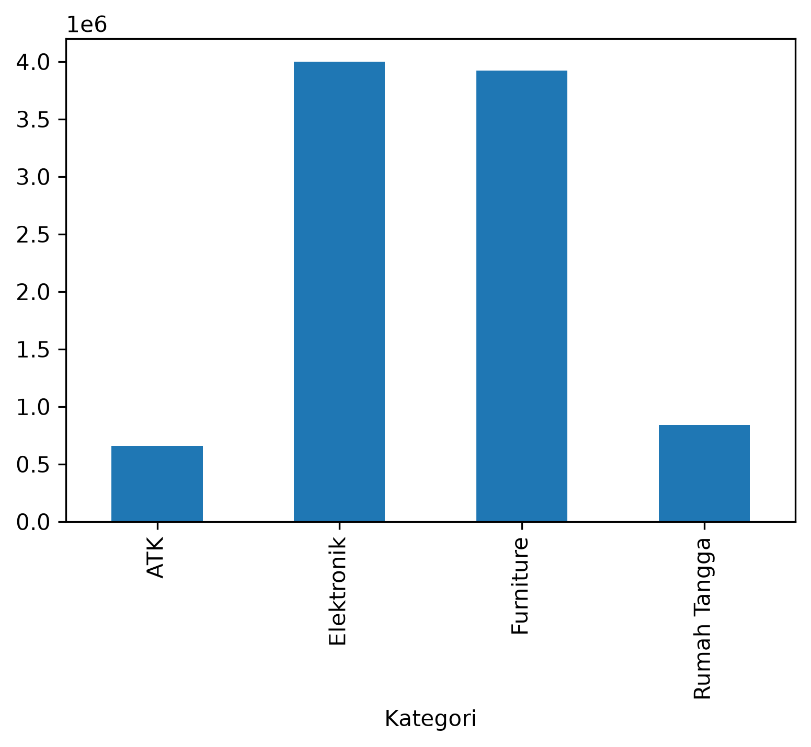
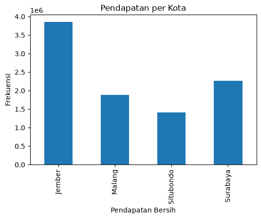
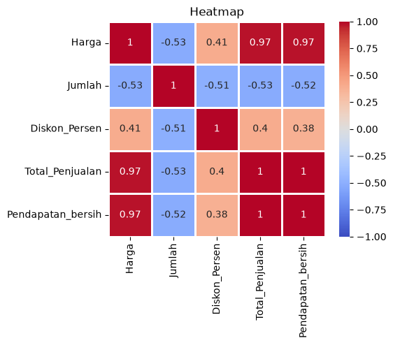
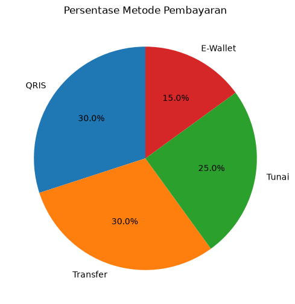

# 📊 Analisis Penjualan Toko

## 📌 Deskripsi Project
Project ini merupakan analisis data penjualan toko menggunakan **python**.
Analisis ini dilakukan untuk memahami pola penjualan, mengidentifikasi faktor yang berkaitan dengan pendapatan toko,
serta memberikan rekomendasi hasil analisis data.

## 🎯 Tujuan Project
- Menganalisis pola penjualan toko.
- Menganalisis kategori produk dengan pendapatan tertinggi.
- Menganalisis metode pembayaran yang paling sering digunakan.
- Menganalisis kota dengan pendapatan bersih tertinggi.
- Menganalisis hubungan antara harga dan jumlah pembelian.
- Memberikan insight dan rekomendasi bisnis berdasarkan data.
## 🛠 Tools yang Digunakan
- Python
- Pandas
- Numpy
- Matplotlib
- Seaborn
- Jupyter Notebook

## 📊 Visualisasi

### Pendapatan Bersih per Kategori



Kategori Elektronik dan Furniture memberikan pendapatan bersih terbesar.

---

### Pendapatan Bersih per Kota



Jember merupakan kota dengan pendapatan bersih tertinggi pada dataset.

---

### Heatmap Korelasi



Heatmap menunjukkan hubungan antar variabel numerik pada dataset.

---

### Metode Pembayaran



QRIS dan Transfer merupakan metode pembayaran yang paling sering digunakan.

## 📂 Dataset
Dataset ini berisi 20 transaksi penjualan toko dengan atribut:

- Tanggal
- ID Transaksi
- Produk
- Kategori
- Harga
- Jumlah
- Kota
- Metode pembayaran
- Diskon persen

## 🔄 Tahapan Analisis
- Data Understanding
- Data Preprocessing
- Feature Engineering
- EDA (Exploratory Data Analysis)
- Business Insight
- Kesimpulan

## 📈 Hasil Analisis
- Kategori Elektronik dan Furniture memiliki pendapatan tertinggi.
- Jember memiliki pendapatan bersih tertinggi pada dataset.
- QRIS dan Transfer merupakan metode pembayaran yang paling sering digunakan.
- Harga memiliki hubungan dengan jumlah pembelian.
- Total Penjualan berkorelasi sangat kuat dengan Pendapatan Bersih.

## 💡 Insight Bisnis
Berdasarkan hasil analisis, toko dapat:

- Mempertahankan ketersediaan produk dengan harga rendah hingga menengah.
- Mempertahankan kategori produk yang memberikan pendapatan tertinggi.
- Mengevaluasi faktor yang mendukung tingginya pendapatan di Jember.
- Memastikan metode pembayaran yang paling sering digunakan selalu tersedia.
- Memantau faktor-faktor yang berkaitan dengan pendapatan bersih.

## 📁 Struktur Project

```
Analisis-Penjualan-Toko/
│
├── datasets/
│   └── penjualan_toko.xlsx
│
├── images/
│   └── bar_kategori.png
│   └── bar_kota.png
│   └── boxplot.png
│   └── Heatmap.png
│   └── Histogram.png
│   └── pie_metode.png
│   └── Scatter_plot.png
│
├── Analisis_Penjualan.ipynb
├── LICENSE
├── README.md
└── requirements.txt
```
## 🚀 Cara Menjalankan Project

1. Clone repository.
2. Install library.
```bash
pip install -r requirements.txt
```
3. Jalankan Jupyter Notebook.
```bash
jupyter notebook
```
4. Buka file `Analisis_Penjualan.ipynb`.